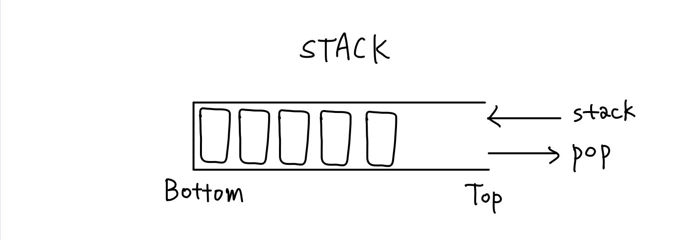

스택, 큐, 덱의 차이점
=================

-----------------

세 개념 모두 데이터를 저장하고 다루는 방식인 자료구조로,
용도에 따라 더 효율적인 특징들을 가지고 있다.

### 스택 (Stack)
- 선입후출(FILO, First In Last Out) 방식이다.
- 주로 프로그램 중복 호출, 입력받은 수식 등을 계산할 때 쓰인다.

### 큐 (Queue)
- 선입선출(FIFO, First In First Out) 방식이다.
- 주로 프로그램의 입력 버퍼, 차례대로 수행하는 대기열 등을 계산할 떄 쓰인다.

### 덱 (Deque, Double-ended Queue)
- 선형 자료의 양방향 끝단에 있는 모든 자료들을 읽을 수 있는 방식이다.
- 주로 데이터를 넣고 뺴는 작업이 많이 이루어질 때 쓰인다.     
